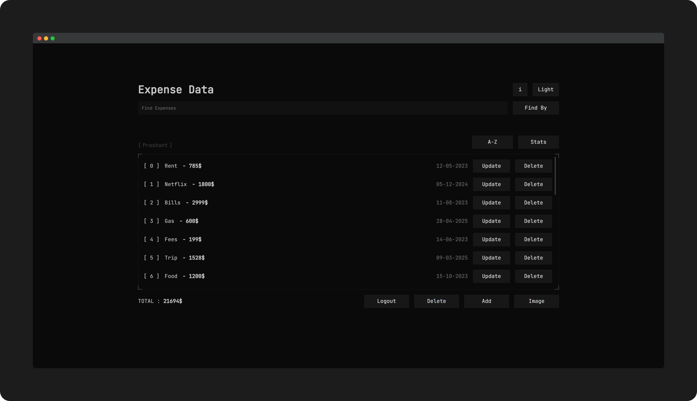
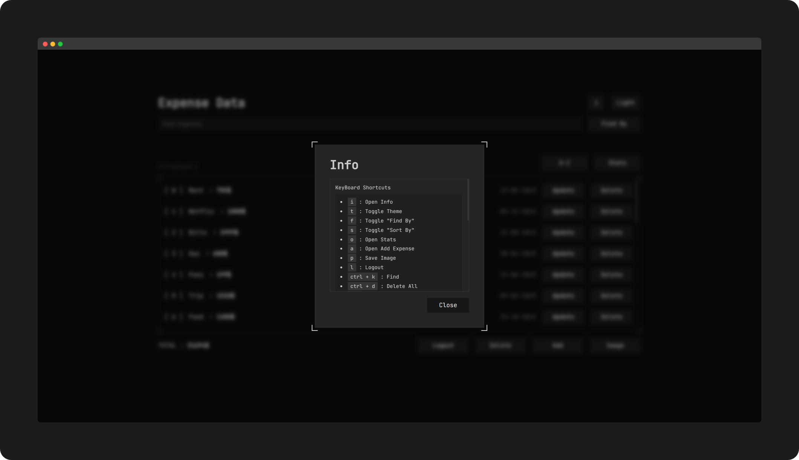
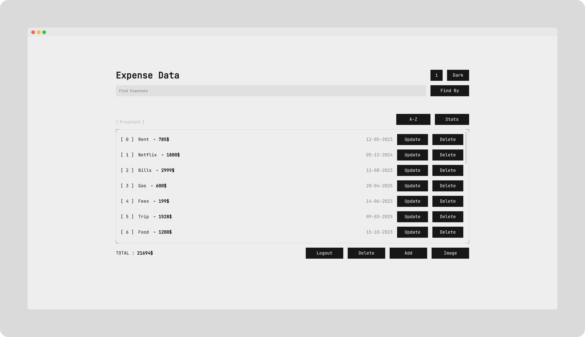
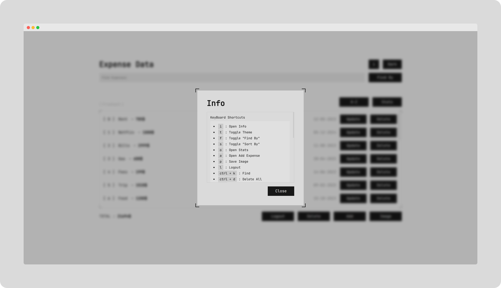

# [Expense-Data](https://praashoo7.github.io/Expense-Data/)

CRUD application built using React+Vite with added Authentication and complete Keyboard navigation to manage the Expense data. Organize Expenses, Manage them, Store them and keep track of them with Expense Chart and reports.<br><br>
This design is mostly inspired by the NFS Most Wanted[2005] video game menu, Which I recreated once using HTML/CSS for fun and I always wanted to implement it in a full scale site! So here we are. You can checkout the NFS MenuCard recreation[with sound] [here.](https://praashoo7.github.io/NFS-MW-MenuCard/).










## Setup
- Clone it!
```sh
git clone https://github.com/Praashoo7/Expense-Data.git
cd Expense-Data
```
- Install Dependencies :
```sh
npm install
```
- Start a local Web Server by running :
```sh
npm start
```

## Credits

JetBrains Font from [Google Fonts](https://fonts.google.com/specimen/JetBrains+Mono) and 
The whole Need for Speed: Most Wanted (2005) Development team!

## License

Expense-Data is open-source Software Licensed under the [MIT License](https://github.com/Praashoo7/Expense-Data/blob/main/LICENSE)
