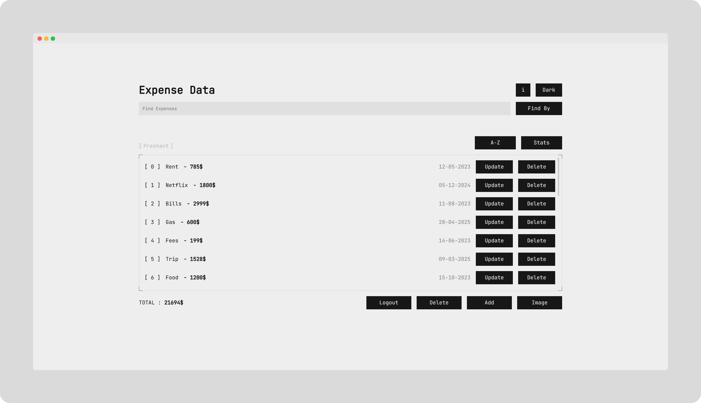

# [Expense-Data](https://praashoo7.github.io/Expense-Data/)

CRUD application built using React+Vite with added Authentication and complete Keyboard navigation to manage the Expense data.<br>





## Setup
- Clone it!
```sh
git clone https://github.com/Praashoo7/Expense-Data.git
cd Expense-Data
```
- Install Dependencies :
```sh
npm install
```
- Start a local Web Server by running :
```sh
npm start
```

## Credits

JetBrains Font from [Google Fonts](https://fonts.google.com/specimen/JetBrains+Mono)

## License

Expense-Data is open-source Software Licensed under the [MIT License](https://github.com/Praashoo7/Expense-Data/blob/main/LICENSE)
